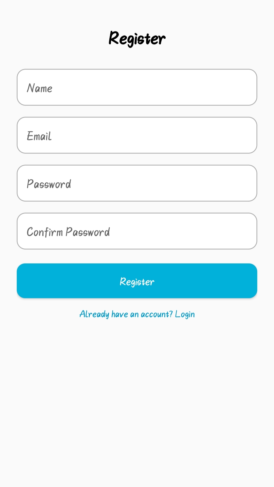

# Posts App

**Android app** connecting with a **Laravel RESTful API** via **Retrofit2**, demonstrating **user authentication** and **CRUD operations on blog posts** using token-based authentication.


---

## ✨ Features

- 🔐 User registration & login (Laravel API)
- 🗾 View all posts or a single post
- ✏️ Create, update, delete posts (**own posts only**)
- 🛢 Retrofit2 for API requests
- 🔁 Token-based auth with **Laravel Sanctum / Passport**
- 🌐 Local API debugging via [ngrok](https://ngrok.com)

---

## 🏗️ Built With

- **Kotlin** (Android)
- **Retrofit2** – HTTP Client
- **Laravel** – Backend REST API
- **Gson** – JSON serialization
- **Ngrok** – Local API tunneling

---

## 🔌 Retrofit Setup

```kotlin
object RetrofitClient {
    private const val BASE_URL = "https://<your-ngrok-url>/"

    val instance: ApiService by lazy {
        val retrofit = Retrofit.Builder()
            .baseUrl(BASE_URL)
            .addConverterFactory(GsonConverterFactory.create())
            .build()

        retrofit.create(ApiService::class.java)
    }
}
```

> 💡 Replace `<your-ngrok-url>` with your actual ngrok HTTPS URL.

---

## 📡 API Endpoints

| Method | Endpoint          | Auth Required | Description           |
|--------|-------------------|---------------|-----------------------|
| POST   | `/api/login`      | ❌            | Login user            |
| POST   | `/api/register`   | ❌            | Register new user     |
| GET    | `/api/posts`      | ✅            | Get all posts         |
| GET    | `/api/posts/{id}` | ✅            | Get single post       |
| POST   | `/api/posts`      | ✅            | Create new post       |
| PUT    | `/api/posts/{id}` | ✅            | Update post           |
| DELETE | `/api/posts/{id}` | ✅            | Delete post           |

---

## 🦪 Testing with Ngrok

To expose your local Laravel API to the internet (for Android to access):

```bash
ngrok http 8000
```

Update `RetrofitClient.BASE_URL` with the HTTPS URL provided by ngrok (e.g., `https://abc123.ngrok-free.app/`)

---

## 🚀 Getting Started

1. Clone this repository
2. Set up your Laravel API backend
3. Run ngrok and update `BASE_URL`
4. Launch Android app

---

## 🔗 Related Projects

- 📱 Android Client: [android-post-to-laravel-api](https://github.com/raffyhidayatulloh/android-post-to-laravel-api)

- 🛠️ Backend API: [laravel-api-for-android-post](https://github.com/raffyhidayatulloh/laravel-api-for-android-post)

---

## 📸 App Screenshots

| Login Screen | Register Screen | Main Activity | Account Detail (Authenticated) |
|--------------|-----------------|---------------|--------------------------------|
|  |  |  | |
