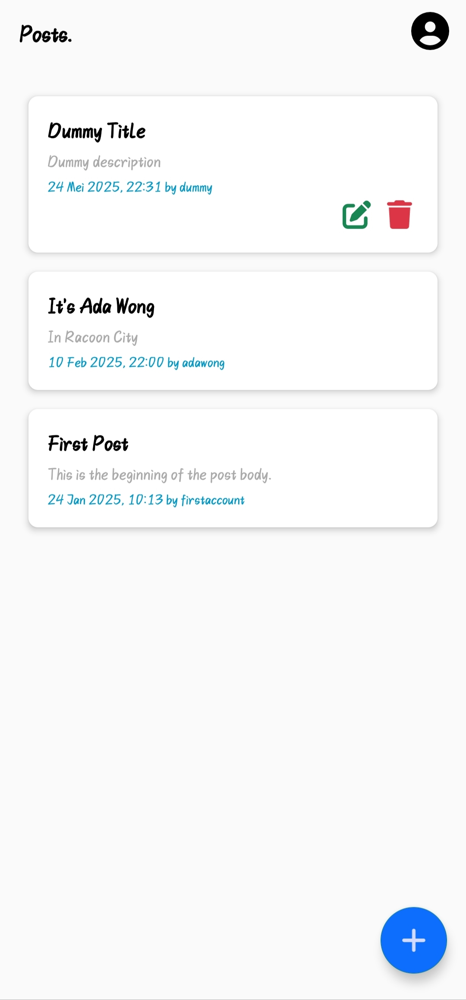
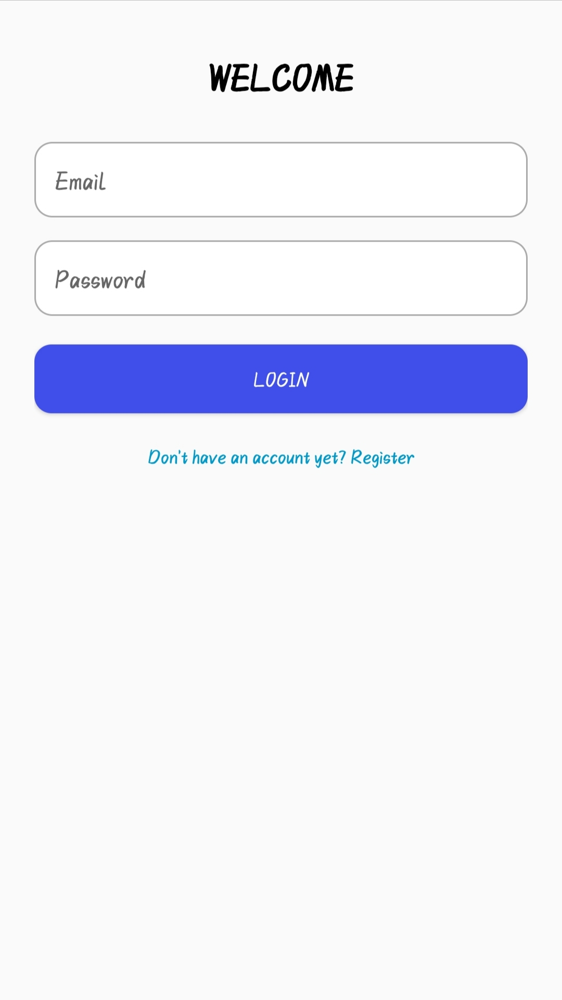
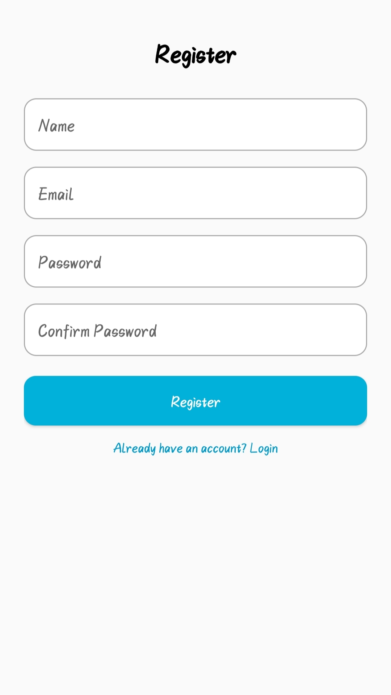
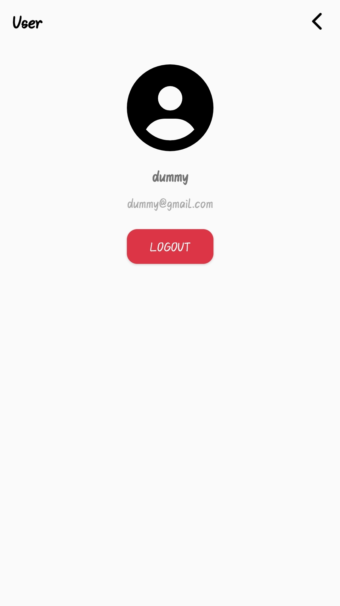

# 📱 Android API Task App

A simple Android application that communicates with a **Laravel** backend using **Retrofit** over a RESTful API.  
This app demonstrates user authentication and CRUD operations on blog posts using token-based authentication.




---

## ✨ Features

- 🔐 User registration & login via Laravel API
- 🗾 Fetch all posts or view individual post
- ✏️ Create, update, and delete posts
- 🛠️ **Only your own posts** will show `Edit` and `Delete` options
- 🛢 Retrofit2 for API requests
- 🔁 Token-based authentication with Laravel Sanctum or Passport
- 🌐 Easily debug with [ngrok](https://ngrok.com)

---

## 🖼️ App Screenshots

### 🔐 Login Screen


### ✍️ Register Screen


### 💳 Account Detail (Authenticated)


---

## 🏗️ Built With

- **Kotlin** (Android)
- **Retrofit2** – HTTP Client
- **Laravel** – Backend RESTful API
- **Gson** – JSON serialization
- **Ngrok** – For local API tunneling

---

## 🔌 Retrofit Client Setup

```kotlin
object RetrofitClient {
    private const val BASE_URL = "https://<your-ngrok-url>/"

    val instance: ApiService by lazy {
        val retrofit = Retrofit.Builder()
            .baseUrl(BASE_URL)
            .addConverterFactory(GsonConverterFactory.create())
            .build()

        retrofit.create(ApiService::class.java)
    }
}
```

> 💡 Replace `<your-ngrok-url>` with your actual ngrok HTTPS tunnel (e.g., `https://abc123.ngrok-free.app/`)

---

## 📡 API Endpoints

| Method | Endpoint          | Auth Required | Description           |
|--------|-------------------|---------------|-----------------------|
| POST   | `/api/login`      | ❌            | Login user            |
| POST   | `/api/register`   | ❌            | Register new user     |
| GET    | `/api/posts`      | ✅            | Get all posts         |
| GET    | `/api/posts/{id}` | ✅            | Get single post       |
| POST   | `/api/posts`      | ✅            | Create new post       |
| PUT    | `/api/posts/{id}` | ✅            | Update post           |
| DELETE | `/api/posts/{id}` | ✅            | Delete post           |

---

## 🦪 Testing with Ngrok

To expose your local Laravel API to the internet (for Android to access):

```bash
ngrok http 8000
```

Update your `RetrofitClient.BASE_URL` with the HTTPS URL provided by ngrok (e.g., `https://abc123.ngrok-free.app/`)

---

## 🚀 Getting Started

1. Clone this repository
2. Set up your Laravel API backend and ensure it’s running
3. Start ngrok to expose the API
4. Update the `BASE_URL` in `RetrofitClient`
5. Run the Android app
